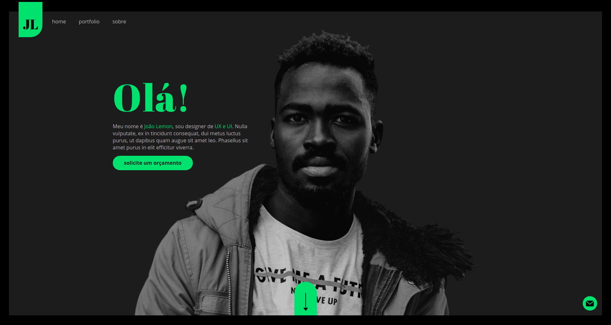

## Site Porfólio HTML/JS/CSS
  

> Este projeto foi desenvolvido durante o curso Front-End Design Essencial do Brunão Souza

*O projeto aborda um portfólio ficticio de um UI/UX designer trabalhando com elementos animados, containers, e outras interações*

*Tela inicial*

*Section 2 com slider de projetos*

*Box de orçamento ao clicar botão Solicite seu orçamento*

*Menu*
 

*botão de contato animado em Javascript*
 

